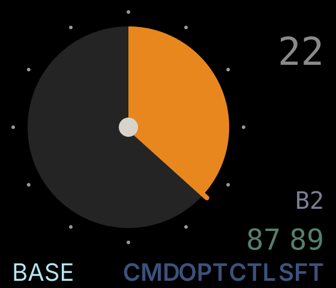
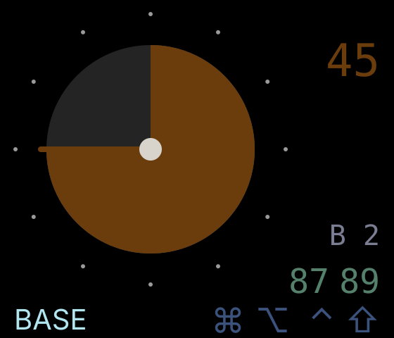
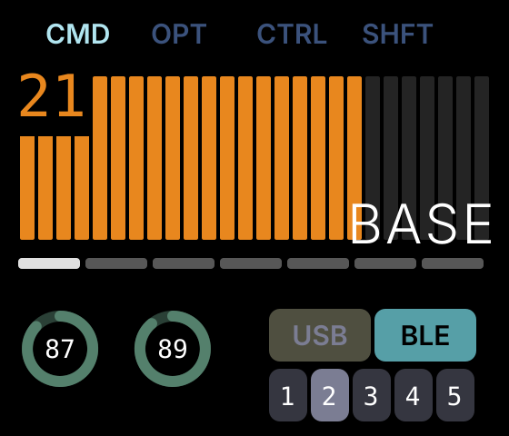

# Prospector ZMK Module

This is a [ZMK module](https://zmk.dev/docs/features/modules) that provides custom status screen support for the [Prospector](https://github.com/carrefinho/prospector) display dongle.


> [!IMPORTANT]
> This branch is a work-in-progress and is only compatible with the Zephyr 4.1 version of ZMK (current main).

> [!NOTE]
> **This is a fork** of [carrefinho/prospector-zmk-module](https://github.com/carrefinho/prospector-zmk-module), branched off `feat/new-status-screens` at `ed98221`.
>
> It adds a **focus-block timer** — see [Focus Block Timer](#focus-block-timer) — and diverges from upstream in two ways:
>
> 1. **A fifth layout, `DIAL`**, built around the timer as a 60 minute analogue face.
> 2. **The Operator layout's WPM meter is replaced by the timer**, with WPM removed entirely including `CONFIG_ZMK_WPM`.
>
> Classic, RADII and Field are untouched.

## Table of Contents

- [Features](#features)
- [Installation](#installation)
- [Status Screens](#status-screens)
- [Focus Block Timer](#focus-block-timer)
- [Usage](#usage)
- [Configuration](#configuration)
- [Troubleshooting](#troubleshooting)
- [Known Issues](#known-issues)
- [To-Do](#to-do)

## Features

- Four status screen layouts to choose from
- Active layer display
- Peripheral battery status
- BLE profile and output indicator
- Active modifier display
- Caps word indicator
- Focus-block countdown timer, as an analogue dial or a bar graph (this fork only)

## Installation

Your ZMK keyboard should be set up with a dongle as central.

Add this module to your `config/west.yml` with these new entries under `remotes` and `projects`:

```yaml
manifest:
  remotes:
    - name: zmkfirmware
      url-base: https://github.com/zmkfirmware
    - name: carrefinho                            # <--- add this
      url-base: https://github.com/carrefinho     # <--- and this
  projects:
    - name: zmk
      remote: zmkfirmware
      revision: main
      import: app/west.yml
    - name: prospector-zmk-module                 # <--- and these
      remote: carrefinho                          # <---
      revision: feat/new-status-screens           # <---
  self:
    path: config
```

Then add the `prospector_adapter` shield to the dongle in your `build.yaml`:

```yaml
---
include:
  - board: xiao_ble//zmk
    shield: [YOUR KEYBOARD SHIELD]_dongle prospector_adapter
```

For more information on ZMK Modules and building locally, see [the ZMK docs page on modules.](https://zmk.dev/docs/features/modules)

## Status Screens

Classic is used by default. To choose a different screen, add one of the following to your `.conf` file:

```ini
CONFIG_PROSPECTOR_STATUS_SCREEN_RADII=y
CONFIG_PROSPECTOR_STATUS_SCREEN_FIELD=y
CONFIG_PROSPECTOR_STATUS_SCREEN_OPERATOR=y
CONFIG_PROSPECTOR_STATUS_SCREEN_DIAL=y
```

`DIAL` is fork-only. Switching between layouts is this one line plus a reflash — only the selected layout is compiled, so the others cost nothing.

## Focus Block Timer

Fork-only. A focus-block countdown, rendered two ways.

### Dial layout

`CONFIG_PROSPECTOR_STATUS_SCREEN_DIAL=y`. The block as a **60 minute analogue face**, with layer, modifiers, profile and battery as plain text around it. A 30 fills half the dial, so the face shows *which* block is running.



Blocks are capped at 60 minutes so the dial never wraps. Ticks are drawn every five minutes; the hand marks the boundary in a brighter orange so it stays legible on top of the filled wedge.

Selecting a length **arms** it without starting anything, and the dial previews it dimmed — so choosing is visible rather than a hidden mode:



Wedge, hand and numeral all dim together, and go to full brightness the moment the block starts.

### Operator layout

`CONFIG_PROSPECTOR_STATUS_SCREEN_OPERATOR=y`. The timer takes the WPM meter's place — same 26-bar geometry and numeric readout, different data source and colour. Bars are proportional to the block length, so the bar always starts full whatever the length.



Both pictures are generated from the widgets' own constants, so they cannot drift from the code. Rerun after changing geometry or colours:

```sh
python3 docs/render_dial_mock.py --minutes 22
python3 docs/render_timer_mock.py --minutes 21 --total 30
```

### Binding

The `zmk,behavior-block-timer` behaviour takes one parameter, from `dt-bindings/zmk/block_timer.h`:

| Parameter | Action |
|---|---|
| `BLK_STOP` | stop and clear a running block |
| `BLK_START` | start the armed length |
| `1`–`999` | arm that many minutes — **does not start** |

```dts
#include <dt-bindings/zmk/block_timer.h>

/ {
    behaviors {
        blk: block_timer {
            compatible = "zmk,behavior-block-timer";
            #binding-cells = <1>;
        };
    };
};
```

> [!IMPORTANT]
> Define the node in your **keymap**, not in a dongle-only overlay. Split peripherals compile the same keymap and must be able to resolve the binding, even though only the dongle renders the widget.

**Arming is separate from starting.** `&blk 30` selects 30 minutes and the dial previews it dimmed; nothing runs until `&blk BLK_START`. The armed length persists across blocks and defaults to 45, so a start with no prior selection is fine.

**A running block is locked.** Arming and starting are both ignored while one runs — only `BLK_STOP` has any effect. A mis-hit therefore cannot discard elapsed time, which is the one piece of state worth protecting. Changing length mid-block is stop, arm, start.

**Guarding the commit** is still worth it, since stopping is destructive:

```dts
blk_go: blk_go {
    compatible = "zmk,behavior-tap-dance";
    #binding-cells = <0>;
    tapping-term-ms = <300>;
    bindings = <&none>, <&blk BLK_START>, <&blk BLK_STOP>;
};
```

First tap does nothing, double tap starts, triple tap stops. Pairing that with a layer that needs both thumbs makes an accidental start or stop essentially impossible.

### Behaviour

- **Minutes round up**, so it never reads finished with 59 seconds left.
- **Armed length previews on the dial** in a dimmed orange before it starts, so selecting a length is visible rather than a hidden mode.
- **One colour throughout** — orange for remaining, grey for spent. No green/amber/red transition: that reads as a deadline, and the timer is meant as pacing.
- **At zero it stops ticking and sits at 0** — empty dial, or empty bar on Operator. No flash, no inversion, no colour change. Deliberately identical to the pre-start state: one quiet state rather than two.

State is a single absolute deadline, with remaining time recomputed from the monotonic uptime clock at render. Nothing that happens to the display affects it, and there is no drift and no clock to set. It is RAM-only: a power cycle is a fresh state, and there is no wall clock to sync.

## Usage

For split keyboards, the peripheral battery widget arranges sub-widgets in pairing order. After flashing the dongle, pair the left side first, then the right side. For more than two peripherals, pair them left to right.

The layer display shows the `display-name` property when available, falling back to the layer index otherwise. To add a `display-name` to a keymap layer:

```dts
keymap {
  compatible = "zmk,keymap";
  base {
    display-name = "Base";           # <--- add this
    bindings = <
      ...
    >;
  }
}
```

## Configuration

To customize, add config options to your `.conf` file:
```ini
CONFIG_PROSPECTOR_USE_AMBIENT_LIGHT_SENSOR=n
CONFIG_PROSPECTOR_FIXED_BRIGHTNESS=80
```

### General
| Name | Description | Default |
| ---- | ----------- | ------- |
| `CONFIG_PROSPECTOR_ROTATE_DISPLAY_180` | Rotate the display 180 degrees | n |
| `CONFIG_PROSPECTOR_USE_AMBIENT_LIGHT_SENSOR` | Use ambient light sensor for auto brightness | y |
| `CONFIG_PROSPECTOR_FIXED_BRIGHTNESS` | Fixed display brightness when not using ambient light sensor | 50 (1-100) |
| `CONFIG_PROSPECTOR_LAYER_NAME_UPPERCASE` | Convert layer names to uppercase (Operator and Radii only) | y |

### Modifiers
| Name | Description | Default |
| ---- | ----------- | ------- |
| `CONFIG_PROSPECTOR_SHOW_MODIFIERS` | Display modifier key indicators | y |
| `CONFIG_PROSPECTOR_SHOW_INACTIVE_MODIFIERS` | Show inactive modifiers dimmed (Classic and Field only) | y |
| `CONFIG_PROSPECTOR_MODIFIER_ORDER` | Order of modifiers: G=GUI, A=Alt, C=Ctrl, S=Shift | "GACS" |

### Field-specific
| Name | Description | Default |
| ---- | ----------- | ------- |
| `CONFIG_PROSPECTOR_ANIMATION_WPM_REFERENCE` | WPM value at which animation reaches max speed | 70 |
| `CONFIG_PROSPECTOR_ANIMATION_INTENSITY_DECAY_SEC` | Seconds for lines to fade out after typing stops | 30 |
| `CONFIG_PROSPECTOR_ANIMATION_FLOW_DECAY_SEC` | Seconds for line directions and length to settle | 300 |

## Troubleshooting

### RAM overflow error

If you encounter a `region 'RAM' overflowed` error when building, add the following to your `.conf` file to reduce the display buffer size:

```ini
CONFIG_LV_Z_VDB_SIZE=25
```

## Known Issues

- One peripheral may fail to register key presses after connecting to the dongle; reset the affected peripheral to fix. https://github.com/zmkfirmware/zmk/issues/3156
- Operator, Radii: battery display only supports up to three peripherals

## To-Do

- Operator: per-profile BLE status
- Radii: document and improve color theme customization
- OS-specific modifier styles
- Caps lock indication
